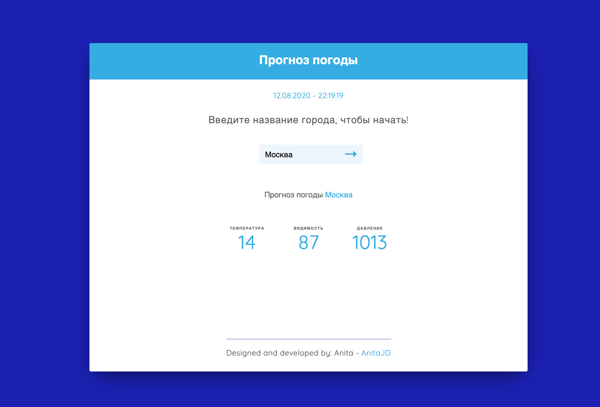

# React Weather App
Средний уровень сложности

## Проектирование сервиса
Язык программирования - JavaScript <br>
Стек технологий - React, Bootstrap, SCSS, API - [https://openweathermap.org/api] <br>
Пользовательский интерфейс - сайт, адаптированный под различные устройства <br>
Формат ответа - данные о температуре, видимости, давлении и отправляются пользователю

## Демонстрация


## Процесс работы программы

**Сервис - через форму на сайте, в котором по введенному названию города пользователем, отображает данные по прогнозу погоды**
Данные приходят от пользователя через интерфейс сайта <br>
 → формируется и отправляется запрос на стороннее API <br>
 → полученный ответ в формате JSON от API используется для формирования ответа пользователю <br>
 → ответ отображается на экране пользователя

## Как запустить
```cd weather-ycloud``` <br> 
Зайдите в файл .gitignore, скопируйте ключ и подставьте в переменную const API_KEY компонента Main.jsx<br>
```npm install``` <br>
```yarn start``` <br>
Откройте [http://localhost:3000](http://localhost:3000) для просмотра в браузере.
